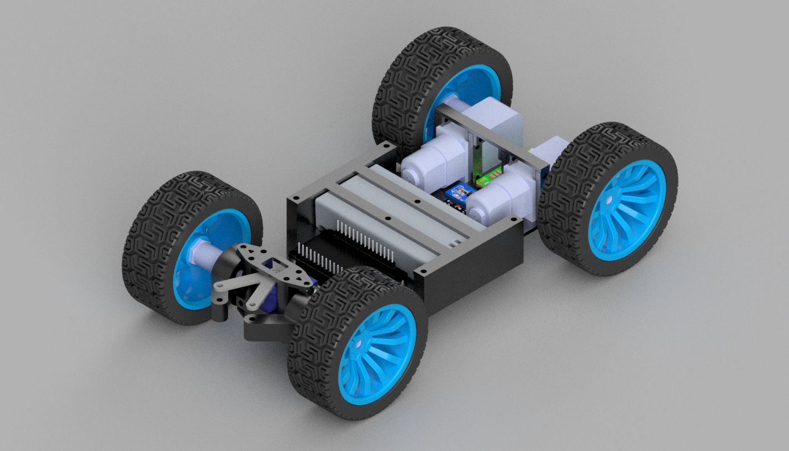
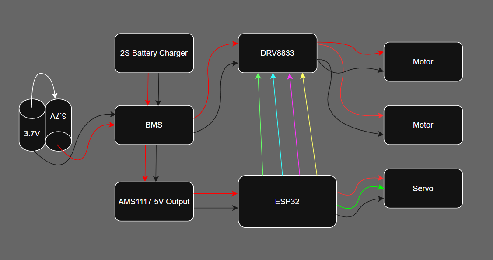
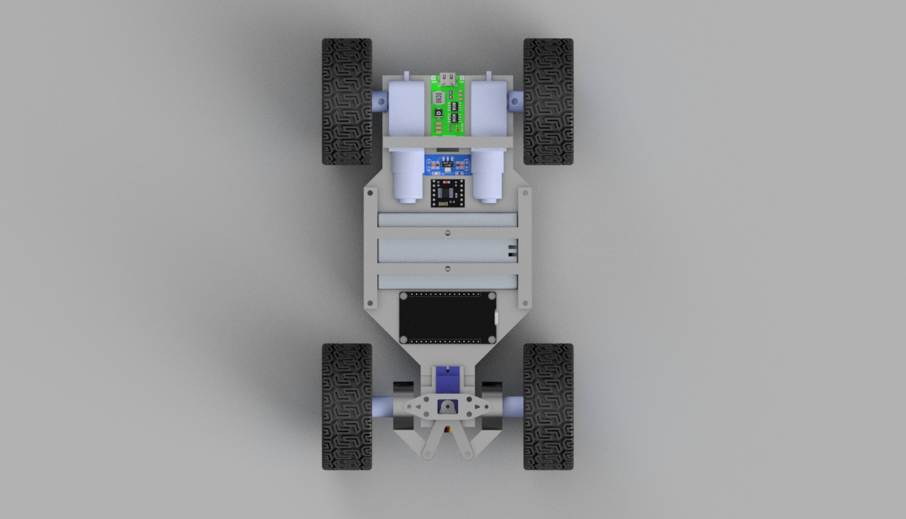
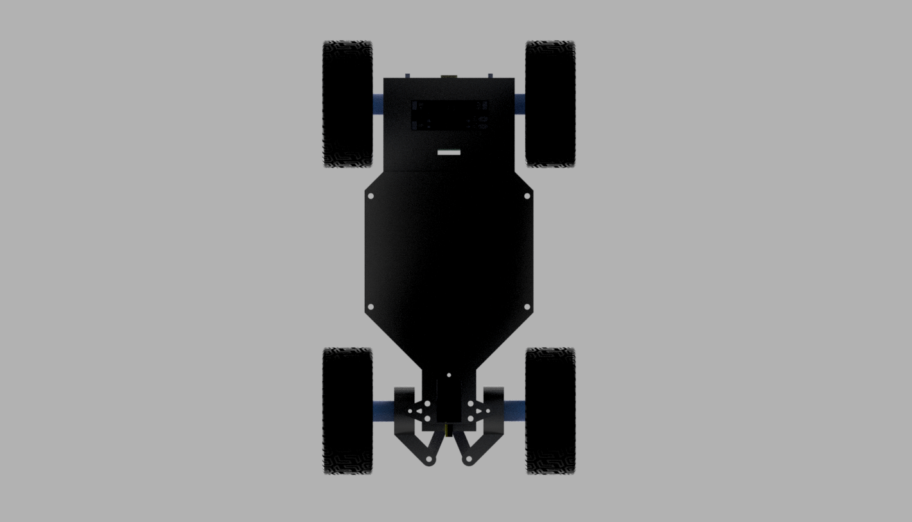
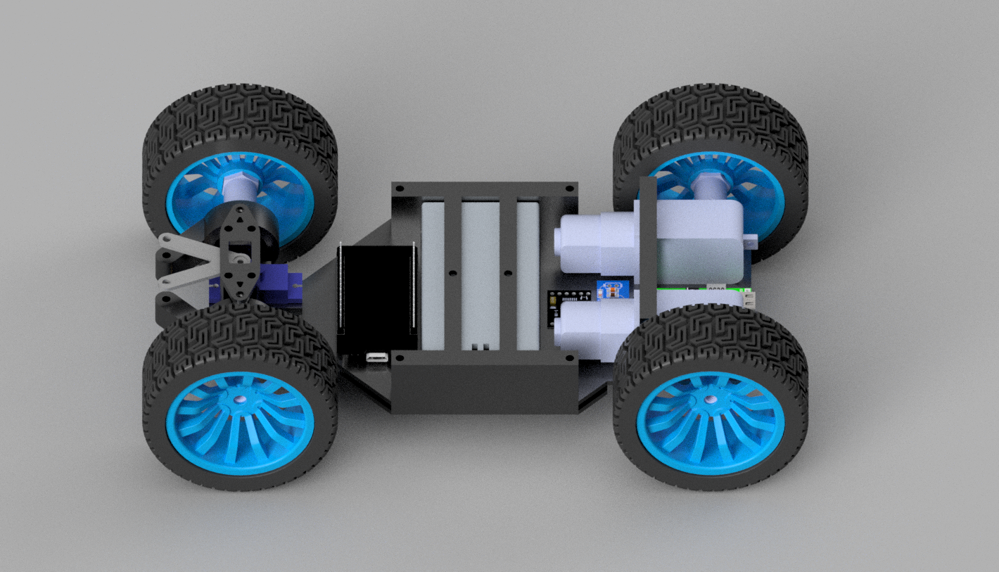
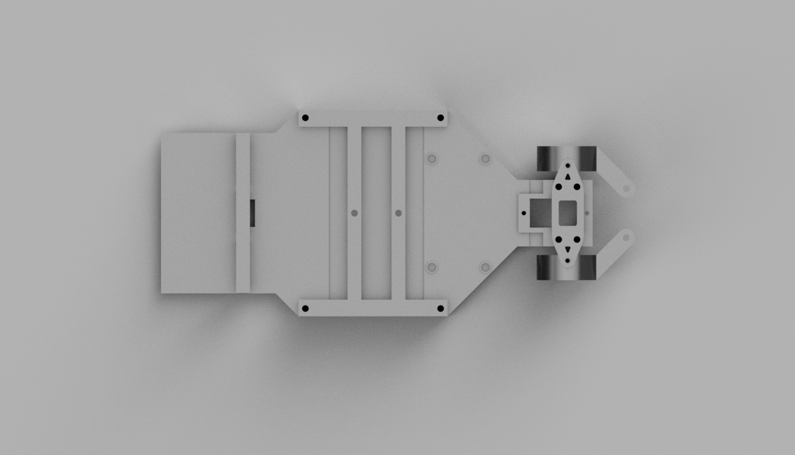
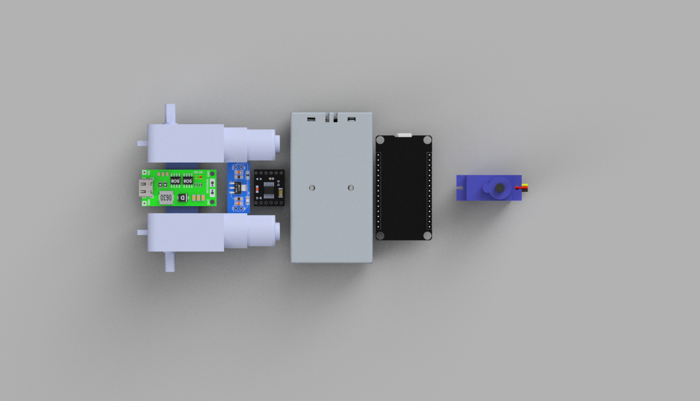

# RC Car

A custom 3D printable RC car with 150 RPM BO Motors and Servo Motors for rotation.

This was my first kinematics (movable parts) projects so I wanted to keep it as simple as possible, that's why used BO Motors instead of high power motors, and used servo for rotating instead of other options.

## Electronics

## Bill Of Materials

|Name                                                       |Purpose                                       |Quantity|Total Cost (USD)|Link                                                                                                                                                   |Distributor|
|-----------------------------------------------------------|----------------------------------------------|--------|----------------|-------------------------------------------------------------------------------------------------------------------------------------------------------|-----------|
|Motor Driver                                               |To control the movement of the motors.        |1       |1.50            |https://robocraze.com/products/tb6612fng-dual-dc-motor-driver                                                                                          |RoboCraze  |
|AMS1117 5V                                                 |To convert the battery output of 7.4V into 5V.|1       |0.20            |https://makerbazar.in/products/ams1117-step-down-power-supply-module?variant=46270092148976                                                            |MakerBazar |
|ESP32                                                      |To control all the components                 |1       |4.00            |https://robocraze.com/products/nodemcu-32-wifi-bluetooth-esp32-development-board30-pin?variant=42268194046176                                          |RoboCraze  |
|Battery Protection Board                                   |To protect the battery from Over Protection   |1       |0.90            |https://makerbazar.in/products/18650-bms-lithium-battery-protection-board?variant=48251032961264                                                       |MakerBazar |
|Battery Charger Module                                     |To the charge the batteries                   |1       |0.95            |https://makerbazar.in/products/green-type-c-multi-cell-2s-3s-4s-to-8-4v-12-6v-16-8v-step-up-boost-lithium-battery-charger-module?variant=47464000323824|MakerBazar |
|Servo Motor                                                |To rotate the front wheels                    |1       |1.60            |https://makerbazar.in/products/small-servo-plastic-gear-svg90s?variant=45449434136816                                                                  |MakerBazar |
|BO Motor                                                   |For driving the wheels                        |2       |1.10            |https://makerbazar.in/products/bo-motor-single-shaft?variant=48251116323056                                                                            |Makerbazar |
|65mm Wheels                                                |To drive the car on the ground                |4       |6.60            |https://robocraze.com/products/65mm-robot-smart-car-rubber-wheel-blue-color?variant=46899383992544                                                     |RoboCraze  |
|18650 Cell Holder                                          |To hold the batteries                         |1       |0.20            |https://robocraze.com/products/18650-2-cell-holder?variant=44442720698592                                                                              |Robocraze  |
|Hex Nuts                                                   |For connecting Wheels to Body and Motor       |2       |1.60            |https://makerbazar.in/products/hexagonal-brass-shaft-coupling-for-robot-smart-car-motor-wheel?variant=44467929121008                                   |MakerBazar |
|Wires  (24  AWG & 18 AWG)                                  |For connecting different components           |        |2.90            |https://makerbazar.in/products/flexible-silicon-wire                                                                                                   |MakerBazar |
|Soldering Components (Wire, Flux, Desoldering Wire, Sponge)|For soldering various components              |        |4.60            |https://robocraze.com/products/noel-solder-wire-60-40-50gm-pack?variant=47362092957920                                                                 |RoboCraze  |
|Allen Key Set                                              |To tighten screws of various size.            |1       |1.00            |https://makerbazar.in/products/9-pcs-chrome-plated-allen-key-hex-key?variant=48251135131888                                                            |MakerBazar |
|Screws and Bolts                                           |For joining various parts to Body.            |        |3.10            |https://makerbazar.in/products/stainless-steel-allen-head-nut-bolt-washer-set                                                                          |MakerBazar |
|3D Printer Filament                                        |For printing the body of the car              |200g    |0.00            |                                                                                                         |Self       |

## Images

